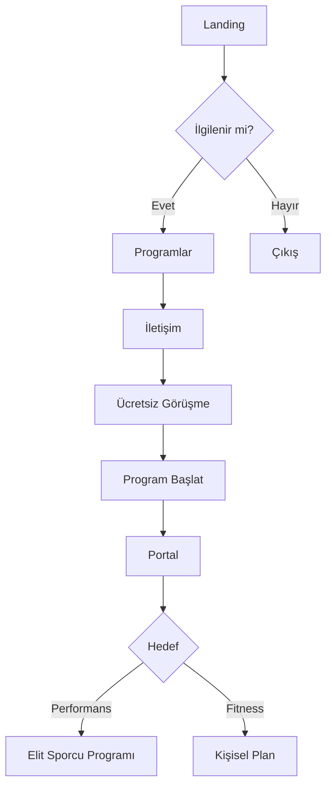
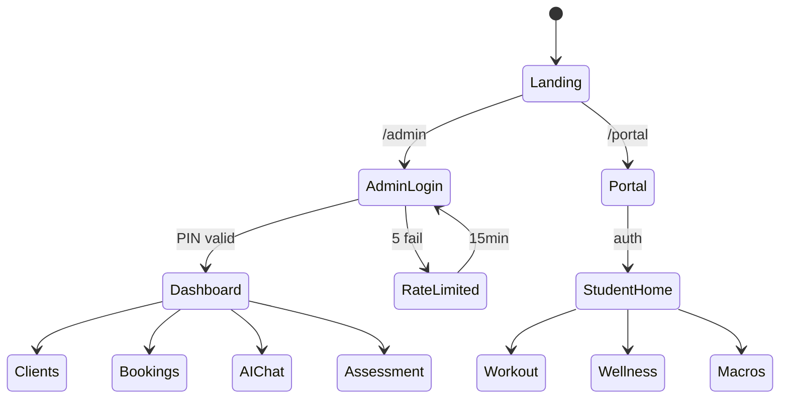
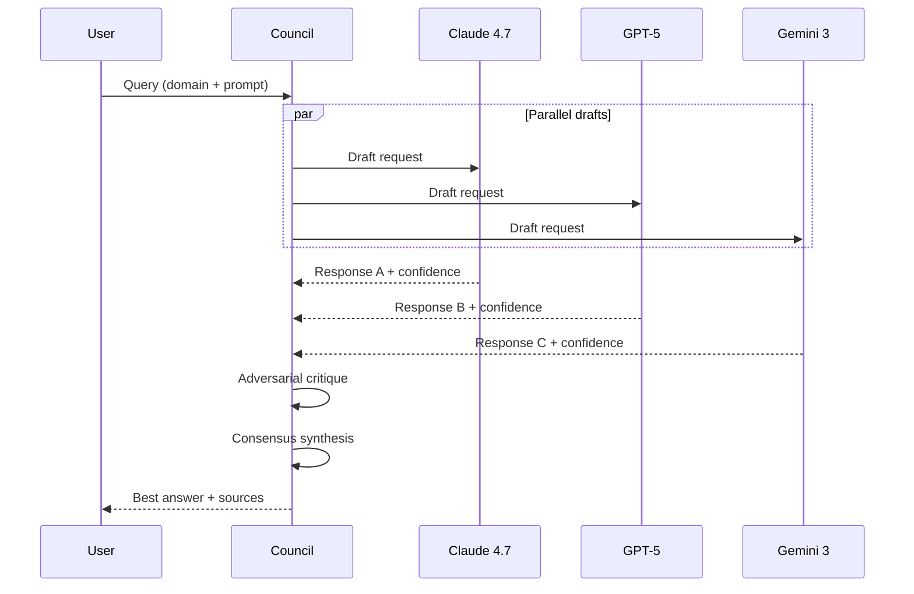
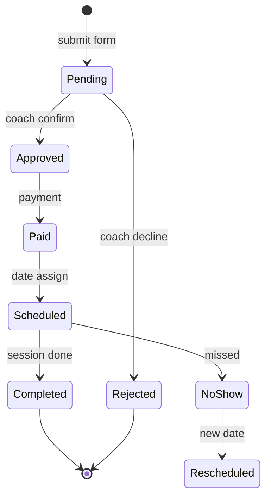
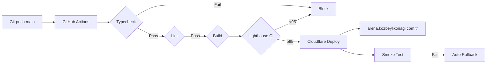

# Mermaid Diagrams — 2026 PT

## Version
Mermaid 11.x (2026 — sequenceDiagram, c4Context, requirement, sankey destek).

## User Flow


## System Architecture (C4 Container)


## State Machine


## AI Council Sequence


## Booking Lifecycle


## Deploy Pipeline


## Usage
- Architecture: `C4Context` / `graph LR|TD`
- User flow: `flowchart TD`
- State: `stateDiagram-v2`
- Sequence: `sequenceDiagram`
- Gantt: `gantt` (timeline)
- ERD: `erDiagram` (DB schema)
- Mindmap: `mindmap`
- Sankey: `sankey-beta` (flow quantity)

## Theme
```mermaid
%%{init: {'theme':'base', 'themeVariables': {
  'primaryColor': '#C8A97E',
  'primaryTextColor': '#1a1a1a',
  'primaryBorderColor': '#8B7355',
  'lineColor': '#D4A574'
}}}%%
```
