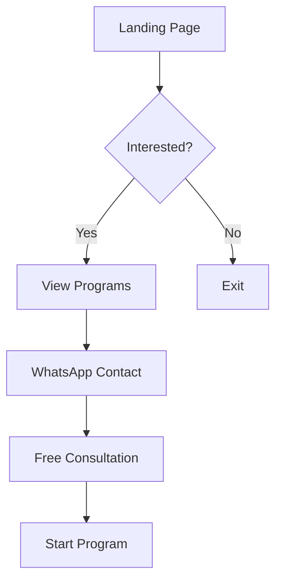
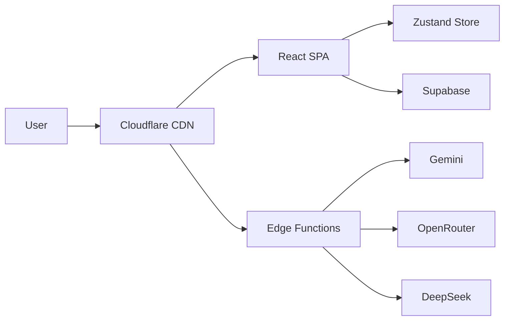
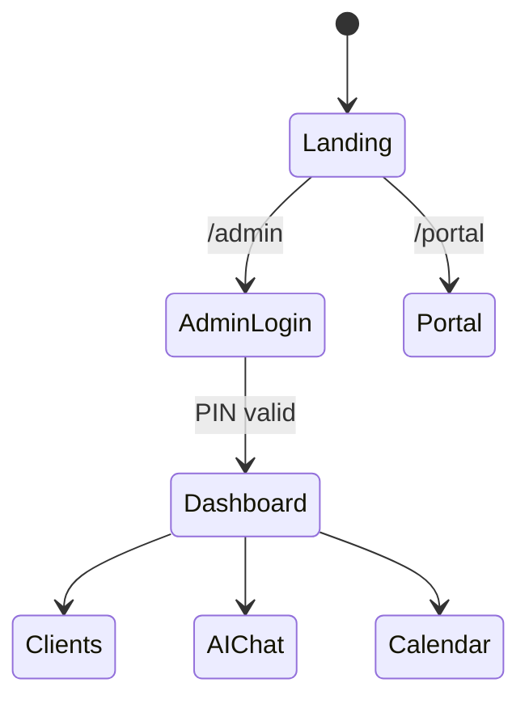
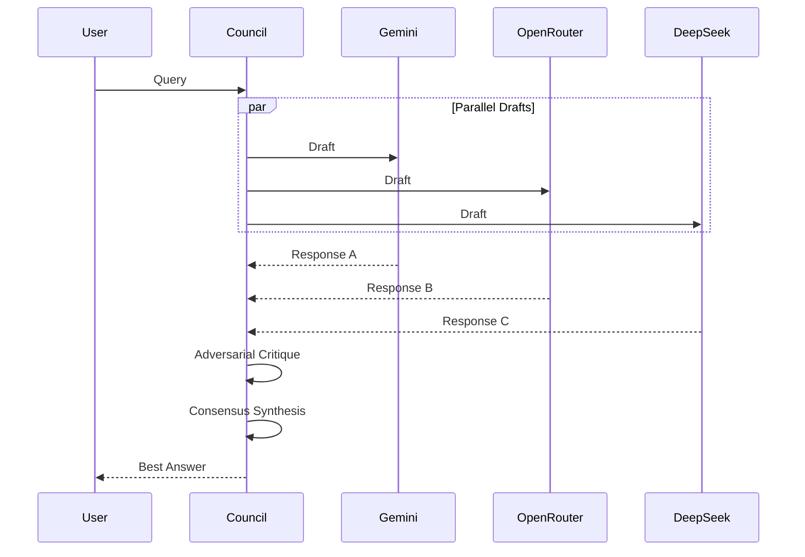

# Mermaid Diagrams Skill

Create architecture and flow diagrams for PT documentation.

## Common Diagram Types

### User Flow

### System Architecture

### State Flow

### AI Council Flow

## Usage
- Architecture docs: graph LR/TD
- User flows: flowchart TD
- State machines: stateDiagram-v2
- API flows: sequenceDiagram
- Timelines: gantt
